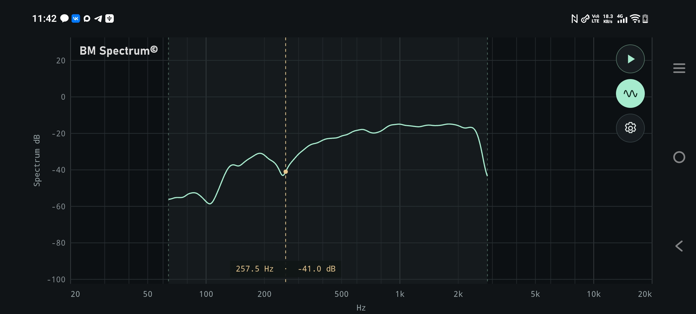
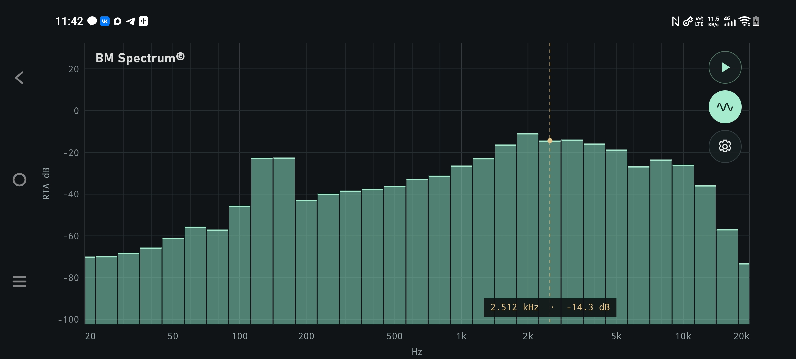

# BM Spectrum for Android

A compact, offline audio analyzer based on desktop BM Spectrum. The main screen is one large, interactive graph with three controls: measurement, generator and settings. Signal processing runs in Kotlin on the phone; the interface uses React. No Python installation or server is needed.

## Measurement algorithms with a focused interface

BM Spectrum brings the desktop project's measurement algorithms into a small, practical interface for professional acoustic work. Its emphasis is on defined PSD normalization, explicit smoothing and repeatable measurements, with numerical regression tests against the desktop implementation and NumPy/SciPy.

A logarithmic chirp repeats the same excitation on every run, avoiding the run-to-run variation of random noise. Final Spectrum analysis uses the entire captured recording, which can resolve finer frequency detail than a short RTA or Welch window. Resolution still depends on recording length and smoothing: chirp alone does not guarantee better resolution than equally long noise measurements. Pink noise remains useful for continuously observing changes in RTA.

For meaningful acoustic measurements, use an external measurement microphone. A phone's built-in microphone and Android processing can strongly shape the result; that setup is mainly useful for trying the interface, rather than evaluating a loudspeaker's response. Examples of measurement microphones include [Behringer ECM8000-U](https://www.behringer.com/en/products/0506-ABU), [miniDSP UMIK-1](https://www.minidsp.com/products/acoustic-measurement/umik-1?showall=1) and [Dayton Audio iMM-6C](https://www.daytonaudio.com/product/1974/imm-6c-idevice-usb-c-calibrated-microphone). These are equipment examples, not a tested compatibility list for this app. Android USB audio routing depends on the phone; this version does not yet apply microphone calibration files or measure calibrated SPL.

## Measurement modes

- **RTA** displays continuously updated 1/3-, 1/6- or 1/12-octave bars. Two line modes provide 512 points with 0.3-octave smoothing or 1024 points with 0.15-octave smoothing. Choose the analysis window and update interval.
- **Spectrum** records a measurement of a chosen duration and displays a smooth spectrum curve. Online Welch provides a live preview; the final result always uses a periodogram of the entire recording, including when stopped early.

Both modes use BM Spectrum's log-Gaussian smoothing and fixed de-pink correction. Levels are relative dB, not calibrated sound pressure levels (SPL).

### Spectrum

A selected measurement band, a spectrum curve and a cursor showing frequency and level:



### RTA

Octave-band bars with the same interactive cursor:



## Using the app

1. Open **Settings**, choose **RTA** or **Spectrum**, set the frequency band and measurement parameters, then tap **Done**.
2. Enable the **Generator** button if you want the phone to produce the measurement signal. This button arms playback; it does not start sound by itself.
3. Tap **Play** and allow microphone access when requested. RTA uses IFFT pink noise; Spectrum uses a logarithmic chirp. The generator starts with the measurement.
4. Tap **Stop** to finish. Spectrum also stops automatically after its configured duration, plus the generator fades when enabled. Playback fades out on stop; the result remains on the graph.

Generator peak amplitude is fixed at **0.9**, approximately **−1 dBFS**. Use Android media volume to adjust playback loudness. With the generator disabled, the app measures incoming sound only.

Chirp adds 0.5 s fade-in and fade-out outside the working sweep: a 5 s sweep takes 6 s in total. Its range is extended so fades fall outside the selected band; the upper tail stays below Nyquist at 48 kHz. Pink noise fades only when starting/stopping, not at each repeated period. RTA uses a rectangular analysis window with the generator enabled and Hann when it is disabled.

Settings open immediately when tapped; measurement and playback finish stopping in the background. Putting the app in the background also stops them. The screen stays awake while measuring. Settings are saved on the device.

## Graph controls

- **Tap or drag horizontally:** select a frequency and read its level. During RTA measurement, the cursor follows the strongest measured frequency and stays at the last maximum when measurement stops.
- **Drag vertically:** move the dB scale.
- **Pinch:** zoom the dB scale.
- **Double-tap:** reset the dB scale and clear the cursor.

The logarithmic frequency axis stays fixed at **20 Hz–20 kHz**. A narrower measurement band is highlighted. During Spectrum measurement, a small progress bar follows the approximate sweep position along the bottom of the graph.

The logo and controls sit over the graph. In landscape orientation the buttons form a vertical column at the upper right. Settings use compact sliders and a two-column landscape layout.

## Defaults

| Setting | Default |
| --- | --- |
| Mode | RTA |
| Frequency band | 20 Hz–20 kHz |
| RTA window / hop | 3 s / 0.1 s |
| RTA bands | 1/3 octave |
| Spectrum duration | 5 s |
| Spectrum smoothing | 0.3 octave |
| Spectrum points | 256 |
| Online Welch | Enabled |
| Welch window / hop | Approximately 0.17067 / 0.085333 s |
| Generator | Disabled |

Spectrum smoothing can be set from 0.1 to 1.0 octave. Welch controls show seconds while preserving exact sample counts internally; window choices remain powers of two.

## Current scope

Capture and analysis use standard Android audio at mono 48 kHz; Android handles routing and resampling. On Android 14+, supported USB outputs use a 48 kHz, 16-bit stereo mixer for simultaneous playback and recording, with the same generator signal on both channels. This version has no reference channel, calibrated SPL, file import/export or saved audio recordings. Spectrum capture is analyzed in memory. The 1/3-, 1/6- and 1/12-octave center grids follow standard fractional-octave spacing and use Gaussian smoothing rather than an IEC-certified filter bank. RTA analyzes the latest complete recording window, so slow processing skips outdated updates instead of accumulating latency.

Numerical DSP tests and device checks have passed on a V2529 running Android 16. USB loopback with a Creative SB X-Fi Surround 5.1 Pro verifies playback and capture of both generators. USB capture uses a separate Android recording mode to avoid the low-frequency filtering observed on this phone. Loopback tones measured approximately -0.09 dB at 20 Hz and -0.52 dB at 20 kHz relative to 1 kHz; compatibility with other phones and interfaces still depends on their audio drivers.

## Build and install

The minimum Android API level is 24 (Android 7.0). Building requires Node.js 22.12+ (or a compatible newer release), JDK 21 and Android SDK platform 36 with build tools. Run from the project root:

```powershell
npm ci
npm run sync
./scripts/android.ps1
& C:/platform-tools/adb.exe install -r android/app/build/outputs/apk/debug/app-debug.apk
& C:/platform-tools/adb.exe shell am start -n com.bm.spectrum/.MainActivity
```

The PowerShell helper detects a local JDK under `.tools/java/` and SDK under `.tools/android-sdk/` if present. These tools are not included in version control. Otherwise configure `JAVA_HOME` and `android/local.properties` for your installation. Adjust the `adb` path as needed.

The debug APK is generated at `android/app/build/outputs/apk/debug/app-debug.apk`. USB installation requires an authorized debugging connection.

`npm run dev` previews the interface in a browser; recording and playback require the Android app.

## Development

GitHub Actions builds the APK, runs numerical tests and Android lint on pushes and pull requests. Version tags publish an APK and SHA-256 checksum as a GitHub Release after those checks pass. Releases currently use the development signing key and remain debug builds; they are not Play Store packages.

See [AGENTS.md](AGENTS.md) for the project structure, DSP decisions, build commands and verification workflow. See [TODO.md](TODO.md) for completed v0.1 work and v0.2 plans.

Built with [React](https://react.dev/), [Capacitor](https://capacitorjs.com/) and [JTransforms](https://github.com/wendykierp/JTransforms).
